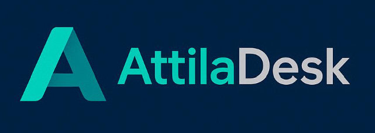

# AttilaDesk | Picidabo Edition

*Kompakt irodai rendszer valódi feladatokra.*

## 🚀 Mi ez?

Az **AttilaDesk** egy saját fejlesztésű adminisztrációs rendszer, mely belső irodai és ügyviteli feladatokat kezel felhasználóbarát módon. Modulárisan épül fel, és kisvállalkozások, csapatok számára ideális.

## 🔧 Főbb modulok

- 📋 **Feladatkezelő** – státusz, határidő, felelős
- 👤 **Ügyféladmin** – kapcsolatok, státusz, kereshetőség
- 🏖️ **Szabadságkezelő** – éves keret, jóváhagyás
- 🔄 **Státuszváltó** – vizuális workflow-léptetések

## 🖥️ Élő demó

👉 [https://albattis.github.io/AttilaDesk-Picidabo-](https://albattis.github.io/AttilaDesk-Picidabo-)

## 📄 Dokumentáció

HTML változatként böngészőből megnyitható.

## 👨‍💻 Fejlesztő

**Albert Attila** – 2025  
További projektjeim: _hamarosan!_

---
